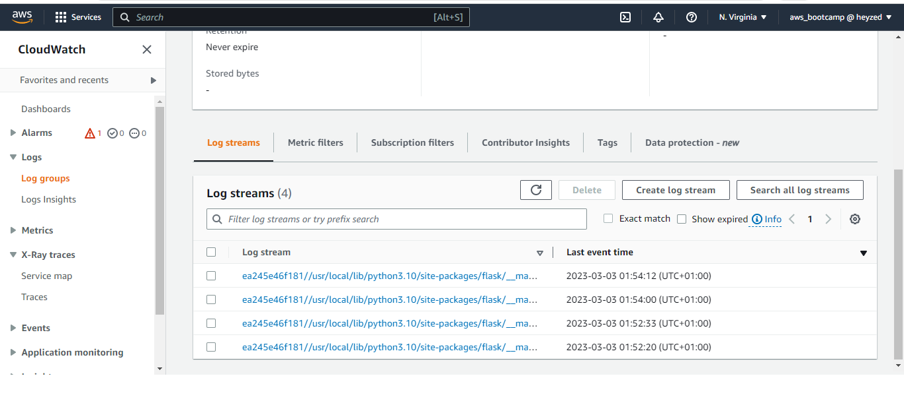

# Week 2 — Distributed Tracing
# TECHNICAL/ CHECKLIST TO-DO TASKS
1. Instrument our backend flask application to use Open Telemetry (OTEL) with Honeycomb.io as the provider
2. Run queries to explore traces within Honeycomb.io
3. Instrument AWS X-Ray into backend flask application
4. Configure and provision X-Ray daemon within docker-compose and send data back to X-Ray API
5. Observe X-Ray traces within the AWS Console
6. Integrate Rollbar for Error Logging
7. Trigger an error an observe an error with Rollbar
8. Install WatchTower and write a custom logger to send application log data to CloudWatch Log group
# HOMEWORK CHALLENGE
1. Add custom instrumentation to Honeycomb to add more attributes eg. UserId, Add a custom span
2. Run custom queries in Honeycomb and save them later eg. Latency by UserID, Recent Traces

# Technical/To-Do Tasks

### 1. INSTRUMENT OUR BACKEND FLASK APPLICATION TO USE OPEN TELEMETRY (OTEL) WITH HONEYCOMB.IO AS THE PROVIDER

Step1: add the following files to our requirements.txt
```sh
opentelemetry-api 
opentelemetry-sdk 
opentelemetry-exporter-otlp-proto-http 
opentelemetry-instrumentation-flask 
opentelemetry-instrumentation-requests

```

Step2: Install dependencies
```sh
pip install -r requirements.txt
```
Step3: Add to the app.py
```sh
from opentelemetry import trace
from opentelemetry.instrumentation.flask import FlaskInstrumentor
from opentelemetry.instrumentation.requests import RequestsInstrumentor
from opentelemetry.exporter.otlp.proto.http.trace_exporter import OTLPSpanExporter
from opentelemetry.sdk.trace import TracerProvider
from opentelemetry.sdk.trace.export import BatchSpanProcessor
```
```sh
# Initialize tracing and an exporter that can send data to Honeycomb
provider = TracerProvider()
processor = BatchSpanProcessor(OTLPSpanExporter())
provider.add_span_processor(processor)
trace.set_tracer_provider(provider)
tracer = trace.get_tracer(__name__)
```
```sh
# Initialize automatic instrumentation with Flask
app = Flask(__name__)
FlaskInstrumentor().instrument_app(app)
RequestsInstrumentor().instrument()
```
Step4: Add the following Environment Variables to backend-flask in docker compose
```sh
OTEL_EXPORTER_OTLP_ENDPOINT: "https://api.honeycomb.io"
OTEL_EXPORTER_OTLP_HEADERS: "x-honeycomb-team=${HONEYCOMB_API_KEY}"
OTEL_SERVICE_NAME: "${HONEYCOMB_SERVICE_NAME}"
```sh
Step5: You'll need to grab the API key from your honeycomb account:

export HONEYCOMB_API_KEY=""
export HONEYCOMB_SERVICE_NAME="backend-flask"
gp env HONEYCOMB_API_KEY=""
gp env HONEYCOMB_SERVICE_NAME="backend-flask"
```
Step5: Verify


### 2. RUN QUERIES TO EXPLORE TRACES WITHIN HONEYCOMB.IO
App.now query


### 3. INSTRUMENT AWS X-RAY INTO BACKEND FLASK APPLICATION
Step1: Add to the requirements.txt
```sh
aws-xray-sdk
```

Step2: Install the dependecies
```sh
pip install -r requirements.txt
```

Step3: Add the following to the app.py file
```sh
from aws_xray_sdk.core import xray_recorder
from aws_xray_sdk.ext.flask.middleware import XRayMiddleware

xray_url = os.getenv("AWS_XRAY_URL")
xray_recorder.configure(service='Cruddur', dynamic_naming=xray_url)
XRayMiddleware(app, xray_recorder)

```

Step4: Add aws/json/xray.json
```sh
{
  "SamplingRule": {
      "RuleName": "Cruddur",
      "ResourceARN": "*",
      "Priority": 9000,
      "FixedRate": 0.1,
      "ReservoirSize": 5,
      "ServiceName": "backend-flask",
      "ServiceType": "*",
      "Host": "*",
      "HTTPMethod": "*",
      "URLPath": "*",
      "Version": 1
  }
}
```
Step5: Run the following commands to creare an xray logging group
```sh
FLASK_ADDRESS="https://4567-${GITPOD_WORKSPACE_ID}.${GITPOD_WORKSPACE_CLUSTER_HOST}"
aws xray create-group \
   --group-name "Cruddur" \
   --filter-expression "service(\"backend-flask\")"
```


Step6: Create a sampling rule
```sh
aws xray create-sampling-rule --cli-input-json file://aws/json/xray.json
```


### 4. CONFIGURE AND PROVISION X-RAY DAEMON WITHIN DOCKER-COMPOSE AND SEND DATA BACK TO X-RAY API

Step1: Add daemon service to the docker compose 
```sh
  xray-daemon:
    image: "amazon/aws-xray-daemon"
    environment:
      AWS_ACCESS_KEY_ID: "${AWS_ACCESS_KEY_ID}"
      AWS_SECRET_ACCESS_KEY: "${AWS_SECRET_ACCESS_KEY}"
      AWS_REGION: "us-east-1"
    command:
      - "xray -o -b xray-daemon:2000"
    ports:
      - 2000:2000/udp

```

Step2: Add these two env vars to our backend-flask in our docker-compose.yml file

```sh
      AWS_XRAY_URL: "*4567-${GITPOD_WORKSPACE_ID}.${GITPOD_WORKSPACE_CLUSTER_HOST}*"
      AWS_XRAY_DAEMON_ADDRESS: "xray-daemon:2000"
```

### 5. OBSERVE X-RAY TRACES WITHIN THE AWS CONSOLE


### 6. INTEGRATE ROLLBAR FOR ERROR LOGGING
Step1: Add to requirements.txt
```sh
blinker
rollbar

```

Step2: Install dependencies
```sh
pip install -r requirements.txt
```

Step3: Set access token
```sh
export ROLLBAR_ACCESS_TOKEN=""
gp env ROLLBAR_ACCESS_TOKEN=""
```

Step4: Add to backend-flask for docker-compose.yml
```sh
ROLLBAR_ACCESS_TOKEN: "${ROLLBAR_ACCESS_TOKEN}"
```

Step5: Import for Rollbar
```sh
import rollbar
import rollbar.contrib.flask
from flask import got_request_exception
```

```sh
rollbar_access_token = os.getenv('ROLLBAR_ACCESS_TOKEN')
@app.before_first_request
def init_rollbar():
    """init rollbar module"""
    rollbar.init(
        # access token
        rollbar_access_token,
        # environment name
        'production',
        # server root directory, makes tracebacks prettier
        root=os.path.dirname(os.path.realpath(__file__)),
        # flask already sets up logging
        allow_logging_basic_config=False)

    # send exceptions from `app` to rollbar, using flask's signal system.
    got_request_exception.connect(rollbar.contrib.flask.report_exception, app)
```

Step6: We'll add an endpoint just for testing rollbar to app.py
```sh
@app.route('/rollbar/test')
def rollbar_test():
    rollbar.report_message('Hello World!', 'warning')
    return "Hello World!"

```


Step7: Verify


### 7. TRIGGER AN ERROR AN OBSERVE AN ERROR WITH ROLLBAR


### 8. INSTALL WATCHTOWER AND WRITE A CUSTOM LOGGER TO SEND APPLICATION LOG DATA TO CLOUDWATCH LOG GROUP

Step1: Add to the requirements.txt
```sh
watchtower
```
Step2: Install the requirements
```sh
pip install -r requirements.txt
```

Step3: Add the following to app.py
```sh
import watchtower
import logging
from time import strftime

```
```sh
# Configuring Logger to Use CloudWatch
LOGGER = logging.getLogger(__name__)
LOGGER.setLevel(logging.DEBUG)
console_handler = logging.StreamHandler()
cw_handler = watchtower.CloudWatchLogHandler(log_group='cruddur')
LOGGER.addHandler(console_handler)
LOGGER.addHandler(cw_handler)
LOGGER.info("some message")
```

```sh
@app.after_request
def after_request(response):
    timestamp = strftime('[%Y-%b-%d %H:%M]')
    LOGGER.error('%s %s %s %s %s %s', timestamp, request.remote_addr, request.method, request.scheme, request.full_path, response.status)
    return response
```
Step4: We'll log something in an API endpoint
```sh
LOGGER.info('Hello Cloudwatch! from  /api/activities/home')
```

Step5: Set the env var in your backend-flask for docker-compose.yml
```sh
      AWS_DEFAULT_REGION: "${AWS_DEFAULT_REGION}"
      AWS_ACCESS_KEY_ID: "${AWS_ACCESS_KEY_ID}"
      AWS_SECRET_ACCESS_KEY: "${AWS_SECRET_ACCESS_KEY}"
```

Step6: Verify



# HOMEWORK CHALLENGE
### 1. ADD CUSTOM INSTRUMENTATION TO HONEYCOMB TO ADD MORE ATTRIBUTES EG. USERID, ADD A CUSTOM SPAN.
* Added a custom span to the Homeactivities and Notificationactivities
  * Homeactivities


  * Notificationactivities


### 2. RUN CUSTOM QUERIES IN HONEYCOMB AND SAVE THEM LATER EG. LATENCY BY USERID, RECENT TRACES
* Trace id
  
* Last 10 minutes
  

***Thank you and see you next week!!!!***
