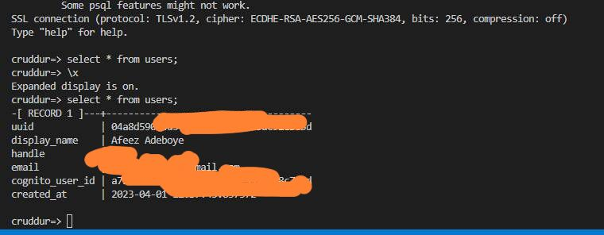

# Week 4 — Postgres and RDS
# REQUIRED TASK
1. Provision an RDS instance ###################
2. Temporarily stop an RDS instance #############
3. Remotely connect to RDS instance ##############
4. Programmatically update a security group rule #####
5. Write several bash scripts for database operations
6. Operate common SQL commands ####################
7. Create a schema SQL file by hand ###############
8. Work with UUIDs and PSQL extensions
9. Implement a postgres client for python using a connection pool
10. Troubleshoot common SQL errors
11. Implement a Lambda that runs in a VPC and commits code to RDS
12. Work with PSQL json functions to directly return json from the database
13. Correctly sanitize parameters passed to SQL to execute

### 1. PROVISION AN RDS INSTANCE
Use the following command to provision an RDS instance 
```sh
aws rds create-db-instance \
  --db-instance-identifier cruddur-db-instance \
  --db-instance-class db.t3.micro \
  --engine postgres \
  --engine-version  14.6 \
  --master-username <<the root username>> \
  --master-user-password <<the password>> \
  --allocated-storage 20 \
  --availability-zone us-east-1a \
  --backup-retention-period 0 \
  --port 5432 \
  --no-multi-az \
  --db-name cruddur \
  --storage-type gp2 \
  --publicly-accessible \
  --storage-encrypted \
  --enable-performance-insights \
  --performance-insights-retention-period 7 \
  --no-deletion-protection

```


### 2. TEMPORARILY STOP AN RDS INSTANCE


### 3. REMOTELY CONNECT TO RDS INSTANCE
Remotely connected and added a database
```sh
  create database cruddur;
```
```sh
  psql -U postgres -h localhost
```

### 4. PROGRAMMATICALLY UPDATE A SECURITY GROUP RULE
Command to update the security groups;
```sh
aws ec2 modify-security-group-rules \
    --group-id $DB_SG_ID \
    --security-group-rules "SecurityGroupRuleId=$DB_SG_RULE_ID,SecurityGroupRule=
    {Description='Allow Workstation PSQL',IpProtocol=tcp,FromPort=5432,ToPort=5432,CidrIpv4=$LOCAL_IP/32}"

```


### 5. WRITE SEVERAL BASH SCRIPTS FOR DATABASE OPERATIONS
The baschscripts file were created in the [/backend/bin](C:\Users\afeez\Desktop\AWS_BOOTCAMP_IMAGES\aws-bootcamp-cruddur-2023\backend-flask\bin) directory The following are some of the good to know: 
1. To ensure each script is executable, one can do batch permission modification by running the following command in the terminal while in the backend-flask directory: `chmod u+x {file path}`
2. For scripts that need to know their current parent directory irrespective of where they are called in the terminal, the following was used:
  ```sh
current_file_path=`realpath $0`
file_parent_dir=`dirname $(dirname $current_file_path)`

  ```
3. To allow for conditional execution, the following was added:
```sh
if [ "$1" = "prod" ]; then
echo "using production url"
CON_URL=$PROD_CONNECTION_URL
else
    CON_URL=$CONNECTION_URL
fi

```


### 6. OPERATE COMMON SQL COMMANDS
```sh
  \x on -- expanded display when looking at data
  \q -- Quit PSQL
  \l -- List all databases
  \c database_name -- Connect to a specific database
  \dt -- List all tables in the current database
  \d table_name -- Describe a specific table
  \du -- List all users and their roles
  \dn -- List all schemas in the current database
  CREATE DATABASE database_name; -- Create a new database
  DROP DATABASE database_name; -- Delete a database
  CREATE TABLE table_name (column1 datatype1, column2   datatype2, ...); -- Create a new table
  DROP TABLE table_name; -- Delete a table
  SELECT column1, column2, ... FROM table_name WHERE  condition; -- Select data from a table
  INSERT INTO table_name (column1, column2, ...) VALUES   (value1, value2, ...); -- Insert data into a table
  UPDATE table_name SET column1 = value1, column2 =   value2, ... WHERE condition; -- Update data in a table
  DELETE FROM table_name WHERE condition; -- Delete data  from a table

```


### 7. CREATE A SCHEMA SQL FILE BY HAND
```sh
  cd backend-flask
  cd lib
  mkdir db
  touch schema.sql
```
Add the following to to the file
```sh
CREATE EXTENSION IF NOT EXISTS "uuid-ossp";

DROP TABLE IF EXISTS public.users;
DROP TABLE IF EXISTS public.activities;
CREATE TABLE public.users (
  uuid UUID DEFAULT uuid_generate_v4() PRIMARY KEY,
  display_name text NOT NULL,
  handle text NOT NULL,
  email text NOT NULL,
  cognito_user_id text NOT NULL,
  created_at TIMESTAMP default current_timestamp NOT NULL
);

CREATE TABLE public.activities (
  uuid UUID DEFAULT uuid_generate_v4() PRIMARY KEY,
  user_uuid UUID NOT NULL,
  message text NOT NULL,
  replies_count integer DEFAULT 0,
  reposts_count integer DEFAULT 0,
  likes_count integer DEFAULT 0,
  reply_to_activity_uuid integer,
  expires_at TIMESTAMP,
  created_at TIMESTAMP default current_timestamp NOT NULL
);

```

### 8. WORK WITH UUIDS AND PSQL EXTENSIONS
Add the following code to the db/schema.sql file
```sh 
  CREATE EXTENSION IF NOT EXISTS "uuid-ossp";

```
Then run the command below to create the extension
```sh
  psql cruddur < db/schema.sql -h localhost -U postgres
```


### 9. RUN DOCKER COMPOSE UP TO VERIFY AN IMPORTED SEED DATA


### 10. CREATE LAMBDA-CONGITO TRIGGER FOR INSERTING USERS INTO DATABASE
To setuo post registration confirmation using lambda function;
1. Create a new function in the aws console follwoing the basic setup below:
   * Author from scratch
   * Provide the function name `cruddur-post-confirmation`
   * Runtime: Python3.8
   * Architecture: x86_64
2. Add the following code;
  ```sh
import os
import json
import psycopg2

def lambda_handler(event, context):
    user = event['request']['userAttributes']
    user_display_name = user["name"]
    user_email = user["email"]
    user_handle = user["preferred_username"]
    user_cognito_id = user["sub"]
        
    try:
        conn = psycopg2.connect(os.getenv("CONNECTION_URL"))
        cur = conn.cursor()
        sql = f"""
        INSERT INTO public.users (
            display_name,
            email, 
            handle, 
            cognito_user_id
            ) 
        VALUES(
            %s, %s, %s, %s
            )
        """ 
        args= (
            user_display_name, 
            user_email, 
            user_handle, 
            user_cognito_id
        )
            
        print(sql)
        cur.execute(sql, args)
        conn.commit()
        print('Commit Done')

    except (Exception, psycopg2.DatabaseError) as error:
        print(error)
        
    finally:
        if conn is not None:
            cur.close()
            conn.close()
            print('Database connection closed.')

    return event

```
3. Select a python layer from [here](https://github.com/jetbridge/psycopg2-lambda-layer) depending on your preference. 
4. Add an environment variable, i.e the `PROD_CONNECTION_URL` 
5. Create and attach a policy to the lambda role;
  ```sh 
{
    "Version": "2012-10-17",
    "Statement": [
        {
            "Effect": "Allow",
            "Action": [
                "ec2:CreateNetworkInterface",
                "ec2:DeleteNetworkInterface",
                "ec2:DescribeNetworkInterfaces",
                "ec2:AttachNetworkInterface",
                "ec2:DescribeInstances"
            ],
            "Resource": "*"
        }
    ]
}

```
6. Sign up to the cruddur app and verify if the cognito user was well integrated as shown below;


11. ### CREATE A NEW ACTIVITIES WITH A BATABASE INSTERTED
1. Refactor the [`db.py`](C:\Users\afeez\Desktop\AWS_BOOTCAMP_IMAGES\aws-bootcamp-cruddur-2023\backend-flask\lib\db.py) module.
```sh
import os
import re
import sys
from flask import current_app as app
from psycopg_pool import ConnectionPool


class Db:
    def __init__(self):
        self.init_pool()

    def init_pool(self):
        """Start a Connection Pool"""
        connection_url = os.getenv("CONNECTION_URL")
        self.pool = ConnectionPool(connection_url)

    def read_sql_template(self, *args):
        """ Reading SQL Templates in db Directory"""
        path_list = list((app.root_path, 'db', 'sql',) + args)
        path_list[-1] = path_list[-1] + ".sql"

        template_path = os.path.join(*path_list)

        green = '\033[92m'
        no_color = '\033[0m'
        app.logger.info("\n")
        app.logger.info(
            f'{green} Load SQL Template: {template_path} {no_color}')

        with open(template_path, 'r') as f:
            template_content = f.read()
        return template_content

    def print_params(self, **params):
        """Print Parameters passed into SQL"""
        blue = '\033[94m'
        no_color = '\033[0m'
        app.logger.info(f'{blue} SQL Params:{no_color}')
        for key, value in params.items():
            app.logger.info(f"{key}: {value}")

    def print_sql(self, title, sql):
        """Print SQL Statement"""
        cyan = '\033[96m'
        no_color = '\033[0m'
        app.logger.info(f'{cyan} SQL STATEMENT-[{title}]------{no_color}')
        app.logger.info(sql)

    def query_commit(self, sql, **params):
        """ Commit a Query"""
        pattern = r"\bRETURNING\b"
        is_returning_id = re.search(pattern, sql)

        if is_returning_id is not None:
            self.print_sql('commit with returning', sql)
        else:
            self.print_sql('commit without return', sql)

        try:
            with self.pool.connection() as conn:
                cur = conn.cursor()
                cur.execute(sql, params)
                if is_returning_id:
                    returning_id = cur.fetchone()[0]
                conn.commit()
                if is_returning_id:
                    return returning_id
        except Exception as err:
            self.print_sql_err(err)

    def query_array_json(self, sql, **params):
        """Query Database and return an array of json"""
        self.print_sql('array', sql)
        self.print_params(**params)

        wrapped_sql = self.query_wrap_array(sql)
        with self.pool.connection() as conn:
            with conn.cursor() as cur:
                cur.execute(wrapped_sql, params)
                json = cur.fetchone()
                app.logger.info(f"Returned JSON: {json}")
                return json[0]

    def query_object_json(self, sql, **params):
        """Query Database and return an array of json"""
        self.print_sql('json', sql)
        self.print_params(**params)

        wrapped_sql = self.query_wrap_object(sql)
        with self.pool.connection() as conn:
            with conn.cursor() as cur:
                cur.execute(wrapped_sql, params)
                json = cur.fetchone()
                if json == None:
                    return {}
                else:
                    return json[0]

    def query_wrap_object(self, template):
        """Wrap query for a json object return"""
        sql = f"""
                (SELECT COALESCE(row_to_json(object_row),'{{}}'::json) FROM (
                {template}
                ) object_row);
            """
        return sql

    def query_wrap_array(self, template):
        """Wrap query for an array of json object return"""
        sql = f"""
                (SELECT COALESCE(array_to_json(array_agg(row_to_json(array_row))),'[]'::json) FROM (
                {template}
                ) array_row);
            """
        return sql

    def print_sql_err(self, err):
        # get details about the exception
        err_type, err_obj, traceback = sys.exc_info()

        # get the line number when exception occured
        line_num = traceback.tb_lineno

        # print the connect() error
        app.logger.info("\npsycopg ERROR:", err, "on line number:", line_num)
        app.logger.info("psycopg traceback:", traceback, "-- type:", err_type)

        # print the pgcode and pgerror exceptions
        app.logger.info("pgerror:", err.pgerror)
        app.logger.info("pgcode:", err.pgcode, "\n")


db = Db()

```
2. Refactor the `home_activities.py`.
```sh
from lib.db import db
from datetime import datetime, timedelta, timezone
from opentelemetry import trace

tracer = trace.get_tracer("home-activities")


class HomeActivities:
    def run(logger=None, cognito_user=None):
        # logger.info("Test from Home Activities")
        with tracer.start_as_current_span("home-activities-mock-data"):
            span = trace.get_current_span()
            now = datetime.now(timezone.utc).astimezone()
            span.set_attribute("app.now", now.isoformat())

            sql = db.read_sql_template('activities', 'home')
            results = db.query_array_json(sql)

            return results

```

3. Refactor the create_activity.py
```sh
from datetime import datetime, timedelta, timezone
from lib.db import db


class CreateActivity:
    def run(message, user_handle, ttl):
        model = {
            'errors': None,
            'data': None
        }

        now = datetime.now(timezone.utc).astimezone()

        if (ttl == '30-days'):
            ttl_offset = timedelta(days=30)
        elif (ttl == '7-days'):
            ttl_offset = timedelta(days=7)
        elif (ttl == '3-days'):
            ttl_offset = timedelta(days=3)
        elif (ttl == '1-day'):
            ttl_offset = timedelta(days=1)
        elif (ttl == '12-hours'):
            ttl_offset = timedelta(hours=12)
        elif (ttl == '3-hours'):
            ttl_offset = timedelta(hours=3)
        elif (ttl == '1-hour'):
            ttl_offset = timedelta(hours=1)
        else:
            model['errors'] = ['ttl_blank']

        if user_handle == None or len(user_handle) < 1:
            model['errors'] = ['user_handle_blank']

        if message == None or len(message) < 1:
            model['errors'] = ['message_blank']
        elif len(message) > 280:
            model['errors'] = ['message_exceed_max_chars']

        if model['errors']:
            model['data'] = {
                'handle':  user_handle,
                'message': message
            }
        else:
            expires_at = (now + ttl_offset)
            uuid = CreateActivity.create_activity(
                user_handle, message, expires_at)

            object_json = CreateActivity.query_object_activity(uuid)
            model['data'] = object_json
        return model

    def create_activity(handle, message, expires_at):
        sql = db.read_sql_template('activities', 'create')
        uuid = db.query_commit(sql,
                            handle=handle,
                            message=message,
                            expires_at=expires_at
                            )
        return uuid

    def query_object_activity(uuid):
        sql = db.read_sql_template('activities', 'object')
        return db.query_object_json(sql, uuid=uuid
                                    )

```
4. Migrated the SQL statement from python modules and created sql file in [`/backend-flask/db/sql/activites`](C:\Users\afeez\Desktop\AWS_BOOTCAMP_IMAGES\aws-bootcamp-cruddur-2023\backend-flask\db\sql\activities) directory.
To fix the `NotNullViolation activities` error so as to get the new posts persistent in your user accont, the following changes was carried out in the frontend code base;
1. Updated the `ActivityForm` component in the `pages/HomeFeedPage.js `to pass the `user_handle` prop as follows;
```sh
  return (
    <article>
      <DesktopNavigation user={user} active={'home'} setPopped={setPopped} />
      <div className='content'>
        <ActivityForm  
          user_handle={user} //Pass the user object here
          popped={popped}
          setPopped={setPopped} 
          setActivities={setActivities} 
        />

```
2. In the `components/ActivityForm.js` component, update the fetch request body to include the `user_handle`:
```sh
        body: JSON.stringify({
          user_handle: props.user_handle.handle, //include it the post request
          message: message,
          ttl: ttl
        }),
      });

```
3. In `app.py` under the `/api/activities` route, assign the `user_handle` variable as follows;
```sh
  user_handle = request.json['user_handle'] # this changes the user
  message = request.json['message']
  ttl = request.json['ttl']

```
Viola, the `create activities` is now implemented as shown below;


***Thank you and see you in the next task!!!!***