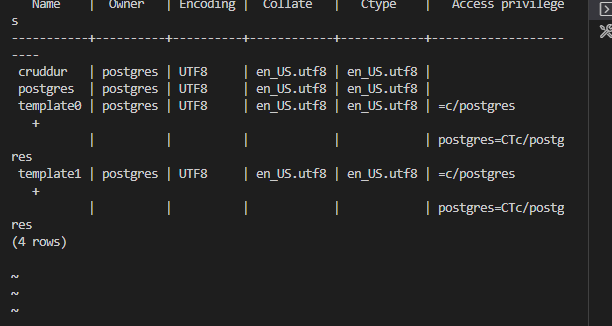

# Week 4 — Postgres and RDS
# CHECKLIST/TO-DO TASK
1. Provision an RDS instance ###################
2. Temporarily stop an RDS instance #############
3. Remotely connect to RDS instance ##############
4. Programmatically update a security group rule
5. Write several bash scripts for database operations
6. Operate common SQL commands ####################
7. Create a schema SQL file by hand ###############
8. Work with UUIDs and PSQL extensions
9. Implement a postgres client for python using a connection pool
10. Troubleshoot common SQL errors
11. Implement a Lambda that runs in a VPC and commits code to RDS
12. Work with PSQL json functions to directly return json from the database
13. Correctly sanitize parameters passed to SQL to execute

### 1. Provision an RDS instance
Use the following command to provision an RDS instance 
```sh
aws rds create-db-instance \
  --db-instance-identifier cruddur-db-instance \
  --db-instance-class db.t3.micro \
  --engine postgres \
  --engine-version  14.6 \
  --master-username <<the root username>> \
  --master-user-password <<the password>> \
  --allocated-storage 20 \
  --availability-zone us-east-1a \
  --backup-retention-period 0 \
  --port 5432 \
  --no-multi-az \
  --db-name cruddur \
  --storage-type gp2 \
  --publicly-accessible \
  --storage-encrypted \
  --enable-performance-insights \
  --performance-insights-retention-period 7 \
  --no-deletion-protection

```


### 2. TEMPORARILY STOP AN RDS INSTANCE


### 3. REMOTELY CONNECT TO RDS INSTANCE
Remotely connected and added a database
```sh
  create database cruddur;
```
```sh
  psql -U postgres -h localhost
```


### 4. CREATE A SCHEMA SQL FILE BY HAND
```sh
  cd backend-flask
  cd lib
  mkdir db
  touch schema.sql
```

### 5. OPERATE COMMON SQL COMMANDS
```sh
  \x on -- expanded display when looking at data
  \q -- Quit PSQL
  \l -- List all databases
  \c database_name -- Connect to a specific database
  \dt -- List all tables in the current database
  \d table_name -- Describe a specific table
  \du -- List all users and their roles
  \dn -- List all schemas in the current database
  CREATE DATABASE database_name; -- Create a new database
  DROP DATABASE database_name; -- Delete a database
  CREATE TABLE table_name (column1 datatype1, column2   datatype2, ...); -- Create a new table
  DROP TABLE table_name; -- Delete a table
  SELECT column1, column2, ... FROM table_name WHERE  condition; -- Select data from a table
  INSERT INTO table_name (column1, column2, ...) VALUES   (value1, value2, ...); -- Insert data into a table
  UPDATE table_name SET column1 = value1, column2 =   value2, ... WHERE condition; -- Update data in a table
  DELETE FROM table_name WHERE condition; -- Delete data  from a table

```
### 6. WORK WITH UUIDS AND PSQL EXTENSIONS
Add the following code to the db/schema.sql file
```sh 
  CREATE EXTENSION IF NOT EXISTS "uuid-ossp";

```
Then run the command below to create the extension
```sh
  psql cruddur < db/schema.sql -h localhost -U postgres
```